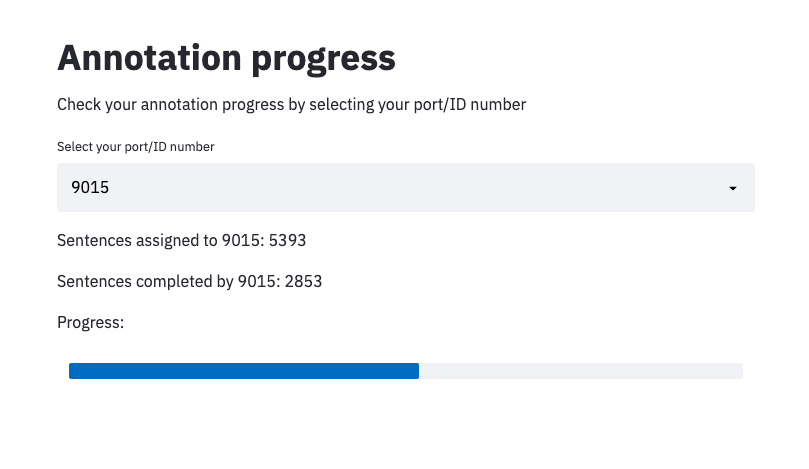

# multiuser_prodigy

This is a multi-annotator setup for [Prodigy](http://prodi.gy/),
Explosion AI's data annotation tool, that uses a Mongo DB to allocate
annotation tasks to annotators working on different Prodigy instances running
on seperate ports. This use case focuses on collecting gold standard
annotations from a team of annotators using Prodigy, rather than on the active
learning, single-annotator setup that Prodigy is primarily intended for.

There are a few examples of annotation interfaces in the repo, including code
for annotators working on training an NER model or doing sentence
classification with document context.  Each annotator works on the Prodigy/port
assigned to them, and a new `DBStream` class handles pulling the examples from
Prodigy that are assigned to each worker.

I've used this setup for three major annotation projects now, but you'll need
to modify the code to get it working for your project as well.

## Mongo database

All tasks are stored in a Mongo DB, which allows different logic for how tasks
are assigned to annotators. For instance, examples can go out to annotators
until three annotations are collected, examples could go to two predetermined
annotators from the wider pool, or annotations can be automatically resubmitted
to a third annotator if the first two annotations disagree.

You can start a Mongo DB in a Docker container:

```
sudo docker run -d -p 127.0.0.1:27017:27017 -v /home/andy/MIT/multiuser_prodigy/db:/data/db  mongo
```

To load a list of tasks into the database:

```
python mongo_load.py -i assault_not_assault.jsonl -c "assault_gsr"
```

where `-i` is a JSONL file of tasks and `-c` specifies the collection name to
load them into.

"seen" : {"$in" : [0,1]}},
            {"coders"

## Running

You'll need to modify the code of `multiuser_db.py` to access the right
collection, set the names/ports of annotators, and the desired interface (NER,
classification, etc).

Then you should launch the processes either in a `screen` or in the background:

```
python multiuser_db.py
```

## Analysis



You can use Streamlit to set up a dashboard so annotators can check their
progress. This one pulls results from the Mongo DB, but you could also call the
Prodigy DB and show results from there.


A more complicated analysis dashboard setup is in 
`Report.Rmd`. This RMarkdown file reads in a CSV of coding information and
generates figures in an HTML page that can be served from the annotation
server. To record information about how long each task takes, add something
like `eg['time_loaded'] = datetime.now().isoformat()` to your stream code and
something like `eg['time_returned'] = datetime.now().isoformat()` to your
update code. `report_maker.py` exports the DB to CSV and knits the RMarkdown on
that CSV.
